# ACCESSING LINUX FILE SYSTEMS

[ 1. Quản lý phân vùng đĩa cứng trên Linux ](#1) 
[2. Các quản lý phân vùng Linux trong quá trình vận hành](#2) 

# 1.Quản lý phân vùng đĩa cứng trên Linux
 

### Khái niệm cơ bản

Một file system xác định cách lưu trữ dữ liệu hoặc thông tin và truy xuất từ ​​đĩa lưu trữ. Đối với hệ điều hành Windows thì các file systems phổ biến là FAT32 và NTFS. Trên hệ điều hành Linux, các file system phổ biến là ext2, ext3, ext4, xfs, vfat, swap, ZFS và GlusterFS.

Phân vùng là một phần của không gian đĩa cứng. Một bảng phân vùng là một phân vùng(partition table) của đĩa chứa thông tin về kích thước và vị trí của các phân vùng trên đĩa cứng. Hai bảng phân vùng phổ biến nhất là MBR và GPT.

###  Quản lý phân vùng ổ cứng bằng tiện ích fdisk

fdisk là tiện ích quản lý phân vùng đĩa cứng trên Linux. 
Sử dụng fdisk, bạn có thể xem, tạo, thay đổi kích thước, xóa, thay đổi, sao chép và di chuyển các phân vùng.

fdisk cho phép tạo tối đa bốn phân vùng chính được Linux cho phép với mỗi phân vùng yêu cầu kích thước tối thiểu 40mb.

Lưu ý: Công cụ fdisk không thể sử dụng đối với bảng phân vùng GUID(GPT) và nó không hoạt động phân vùng lớn hơn 2TB.

Sử dụng lệnh `fdisk -l` để xem tất các phân vùng hiện có 

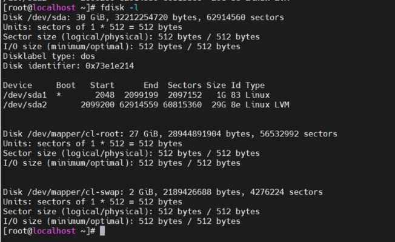 

 Xem phân vùng trên một đĩa cụ thể `fdisk -l /dev/sda2`

 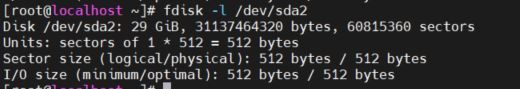 

 Xem tất cả các lệnh disk ` fdisk /dev/sdb`

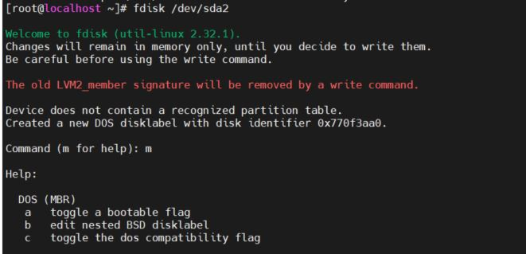 

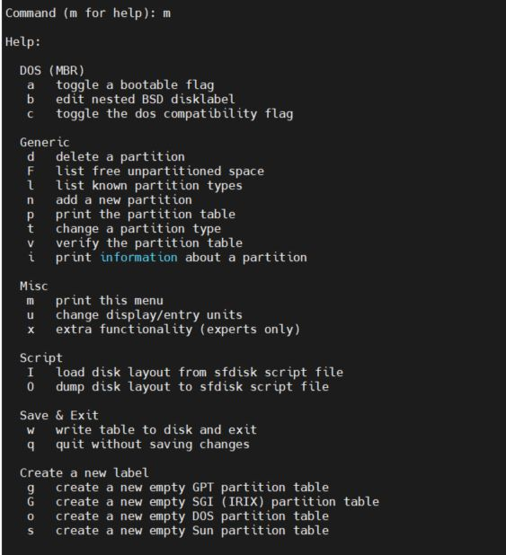 

### Tạo phân vùng mới

B1: nhập lệnh 'fdisk -l /dev/sda2'

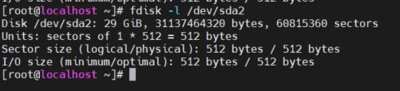 

 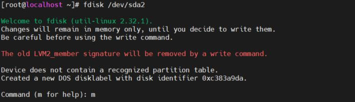

B2: nhap n 

 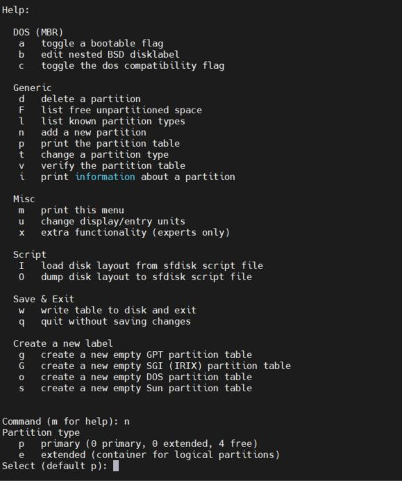
 
Tại đây  nhập p cho phân vùng chính hoặc e cho phân vùng mở rộng

B3: Chọn dung lượng cho phân vùng mới và lưu thay đổi 

  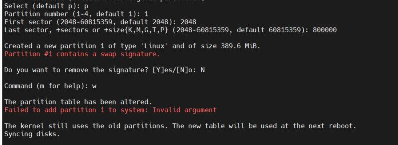

B4:  Kiểm tra lại thay đổi 

  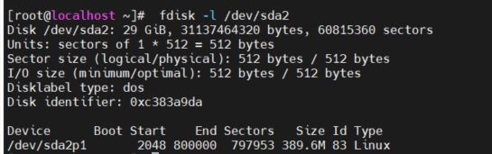

B5: Sau khi tạo phân vùng phải thông báo cho hệ điều hành để cập nhật bảng phân vùng

  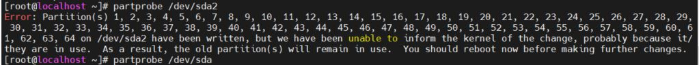

B6: Bảng phân vùng đã được cập nhật. Chúng ta phải định dạng phân vùng của để sử dụng.
 Hệ thống định dạng tệp được hỗ trợ Linux là xfs.
  Lệnh sau để định dạng phân vùng sda2  với xfs.
` mkfs.xfs /dev/sda2p1`

#  2.Các quản lý phân vùng Linux trong quá trình vận hành 
 
1. Lệnh du

Lệnh du ước tính và tóm tắt sử dụng không gian tệp và thư mục

Liệt kê kích thước của một thư mục trong đơn vị đã cho (B/KB/MB) : 
Ví dụ liệt kê kích tướng của file etc '  du -b /etc/'

 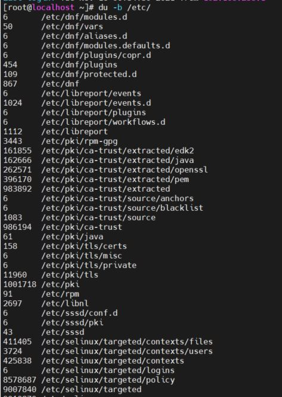

 Liệt kê các kích thước của một thư mục ở dạng có thể đọc được(tự động chọn đơn vị thích hợp cho từng kích thước)

  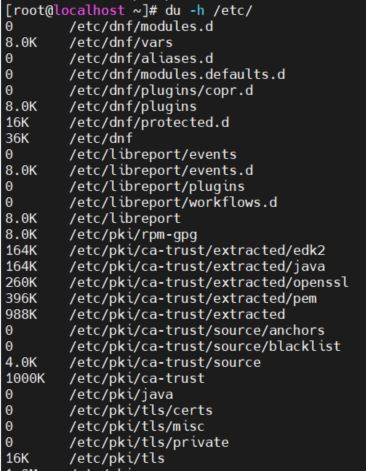

1. Lệnh df 

Lệnh `df` cung cấp một cái nhìn tổng quan về việc sử dụng không gian đĩa hệ thống tập tin.
  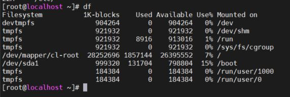

Hiển thị tất cả các hệ thống tệp và việc sử dụng đĩa của chúng ở dạng người có thể đọc được

 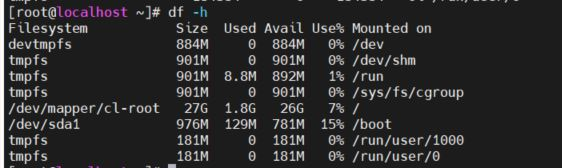

1. Lệnh fsck

Lệnh fsck kiểm tra và sửa chữa hệ thống tệp Linux.

 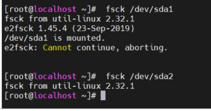

1. MOUNTING AND UNMOUNTING FILE SYSTEMS

`lsblk` 
Lệnh để xem thiết bị sẵn có 

 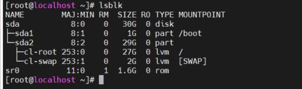

Mounting by Block Device Name

  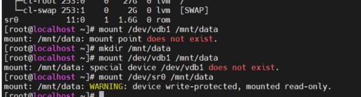

Mounting by File-system UUID

 `lsblk -fp`: Liệt kê đường dẫn đầy đủ của thiết bị cùng UUID và các mount points 

  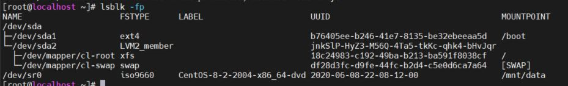

Mount file system by the UUID 

  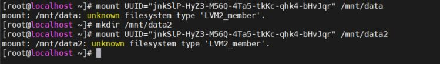

# Tham khao: 

https://blogd.net/linux/quan-ly-phan-vung-dia-cung-tren-linux/
