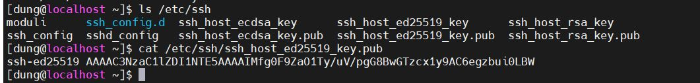

## CONFIGURING AND SECURING SSH  
 * [1. ACCESSING THE REMOTE COMMAND LINE WITH SSH](#1)  
 * [2.CONFIGURING SSH KEY-BASED AUTHENTICATION](#2)  
 * [3.CUSTOMIZING OPENSSH SERVICE CONFIGURATION](#3) 

 
### 1. ACCESSING THE REMOTE COMMAND LINE WITH SSH
Giao thức cho phép máy khách, máy chủ truyền gửi lệnh, dữ liệu cách an toàn 

Sử dụng lệnh `w` để hiển thị những người dùng đang kết nối với hệ thống 
 

Người dùng dung đăng nhập qua pts/0 với địa chỉ IP 192.168.238.1 vào lúc 4:14 

SSH Host Key 
SSH bảo mật thông qua mã hóa công khai. Khi SSH Client kết nối với SSH Server, server sẽ guiwr một public key của nó cho máy khách trước khi máy khách đăng nhập. Nó được sử dụng để thiết lập mã hóa an toàn cho kênh liên lạc và xác thực có kết nối từ server tới client 

Khi người dùng sử dụng lệnh SSH để kết nối với server SSH, lệnh sẽ kiểm tra xe, có phải bản sao public key nằm trong file host của máy chủ. Mặc định ở 
/etc/ssh/ssh_known_hosts hoặc ~/.ssh/known_hosts 

Nếu máy khách có public key, SSH sẽ so sánh khóa từ các tệp của server. Nếu nó không khớp. Máy chủ có thể bị tấn công, xâm nhập, Gửi lại thông báo xem có tiếp tục kết nôi không 

Nếu máy khách không có bản sao khóa công khai trong các tệp máy chủ đã biết của nó, lệnh SSH sẽ hỏi bạn nếu bạn muốn đăng nhập bằng cách khác. Một bản sao của khóa công khai sẽ được lưu ở ~/.ssh/known_hosts  và được xác thực trong tương lai 

SSH Known Hosts Key Management

Nếu khóa công khai của máy chủ thay đổi vì khóa bị mất do lỗi. Cần phải chỉnh sửa các public key để đảm bảo việc kết nối 

Public key được lưu ở /etc/ssh/ssh_known_hosts and each users' ~/.ssh/
known_hosts 

`cat /etc/ssh/ssh_host_ed25519_key.pub`

 
### 2.CONFIGURING SSH KEY-BASED AUTHENTICATION

SSH KEY-BASED AUTHENTICATION

Có thể cấu hình máy chủ SSH để cho phép xác thực nếu không có mật khẩu bằng Key-Based 
Tạo một cặp khóa public key và private key 
Đặt public key trong tài khoản của bạn tại server. SSH servẻ sử dụng public key để kiểm tra client bằng cách nhập qua bàn phím. SSH client có thể tự động xác thực thông tin của bạn vào server với private key duy nhất của bạn 

Generating SSH Keys

Để tạo ra public key và private key khớp vào nhau để xác thực bạn sử dụng lệnh `ssh-keygen`. Theo mặc định bạn các public key và private key sẽ được lưu ở ~/.ssh/id_rsa và ~/.ssh/id_rsa.pub 

Nếu như không tạo mật khẩu thì bất cứ ai cũng có thể vào private key dẫn đến ko an toàn 

Tạo public key và private key 

`ssh-keygen -f .ssh/key-with-pass`

Sharing the Public Key

Trước khi thực hiện xác thực. Khóa công khai cần được copy vào server 

Sử dụng `ssh-copy-id ` để cop public key vào hệ thống 

Using ssh-agent for Non-interactive Authentication

Sử dụng lệnh `ssh-agen` để tạm thời lưu trữ mật khẩu trong bộ nhớ. Khi đó bạn đỡ mất công để nhập mật khẩu mỗi lần kết nối. giảm thiểu rủi ro khi bị nhìn thấy gõ mật khẩu 

 
## 3.CUSTOMIZING OPENSSH SERVICE CONFIGURATION

PROHIBIT THE SUPERUSER FROM LOGGING IN USING SSH

Sử dụng cấu hình  PermitRootLogin  ở /etc/ssh/sshd_config để cấu hình ko cho người dùng đăng nhập với quyền root 

`PermitRootLogin yes` 

Nguồn: 

Sách Red_Hat_Enterprise_Linux_8_0_RH124_Red_Hat_System_Administration