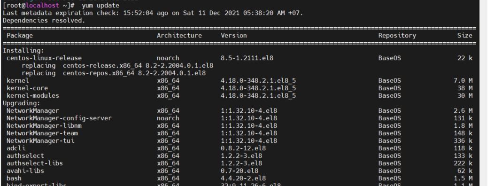
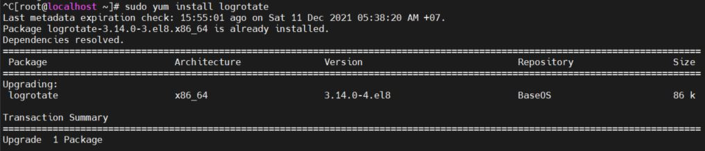
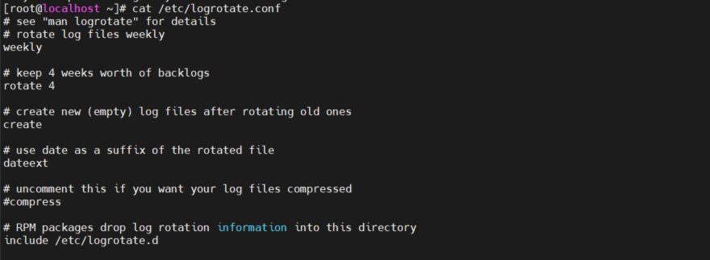
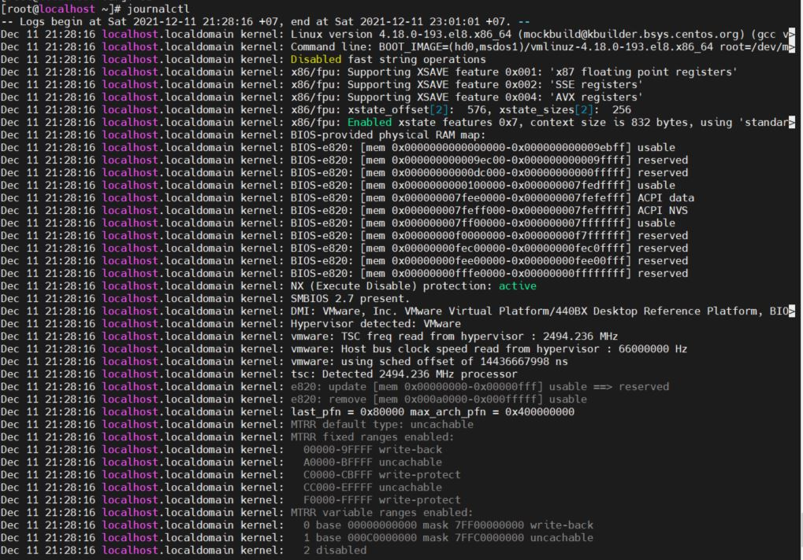
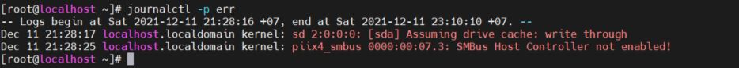
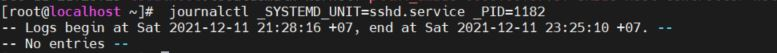
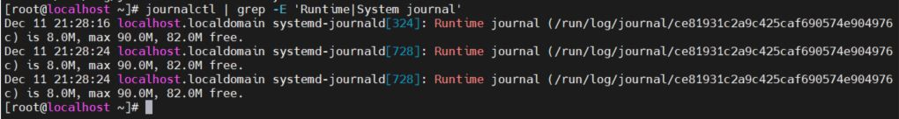

# ANALYZING AND STORING LOGS

Mục lục 

[ 1. Log ](#1)

[2. Syslog file](#2)

[3. System Journal Entries](#3)

[4. PRESERVING THE SYSTEM JOURNAL](#4)

[5. Configuring Persistent System Journals](#5)

1 . Log 
 

 Log ghi lại liên tục các thông báo về hoạt động của cả hệ thống hoặc của các dịch vụ được triển khai trên hệ thống và file tương ứng. Log file thường là các file văn bản thông thường dưới dạng “clear text” tức là bạn có thể dễ dàng đọc được nó, vì thế có thể sử dụng các trình soạn thảo văn bản (vi, vim, nano…) hoặc các trình xem văn bản thông thường (cat, tailf, head…) là có thể xem được file log.

Các file log có thể nói cho bạn bất cứ thứ gì bạn cần biết, để giải quyết các rắc rối mà bạn gặp phải miễn là bạn biết ứng dụng nào. Mỗi ứng dụng được cài đặt trên hệ thống có cơ chế tạo log file riêng của mình để bất cứ khi nào bạn cần thông tin cụ thể thì các log file là nơi tốt nhất để tìm.

Các tập tin log được đặt trong thư mục /var/log. Bất kỳ ứng dụng khác mà sau này bạn có thể cài đặt trên hệ thống của bạn có thể sẽ tạo tập tin log của chúng tại /var/log. Dùng lệnh ls -l /var/log để xem nội dung của thư mục này.

Ý nghĩa một số file log thông dụng có mặc định trên /var/log

/var/log/messages – Chứa dữ liệu log của hầu hết các thông báo hệ thống nói chung, bao gồm cả các thông báo trong quá trình khởi động hệ thống.

/var/log/maillog hoặc /var/log/mail.log – Thông tin log từ các máy chủ mail chạy trên máy chủ.

/var/log/secure – Thông điệp an ninh liên quan sẽ được lưu trữ ở đây. Điều này bao gồm thông điệp từ SSH daemon, mật khẩu thất bại, người dùng không tồn tại, vv

/var/log/cron – Chứa dữ liệu log của cron deamon. Bắt đầu và dừng cron cũng như cronjob thất bại.

2. Syslog file

logging event to system 

Syslog là một giao thức client/server là giao thức dùng để chuyển log và thông điệp đến máy nhận log. Máy nhận log thường được gọi là syslogd, syslog daemon hoặc syslog server

Trong chuẩn syslog, mỗi thông báo đều được dán nhãn và được gán các mức độ nghiêm trọng khác nhau. Các loại phần mềm sau có thể sinh ra thông báo: auth, authPriv, daemon, cron, ftp, dhcp, kern, mail, syslog, user,… Với các mức độ nghiêm trọng từ cao nhất trở xuống Emergency, Alert, Critical, Error, Warning, Notice, Info, and Debug.

|Code|Mức cảnh báo|	Ý nghĩa|
|---------|--------------|---------|
|0|emerg|	Thông báo tình trạng khẩn cấp|
|1|alert|	Hệ thống cần can thiệp ngay|
|2|crit|	Tình trạng nguy kịch|
|3|error|	Thông báo lỗi đối với hệ thống|
|4|warn|	Mức cảnh báo đối với hệ thống|
|5|notice|	Chú ý đối với hệ thống|
|6|info|	Thông tin của hệ thống|
|7|debug|	Quá trình kiểm tra hệ thống|

log file rotation 

là một tiện ích tuyệt vời trên Linux giúp đơn giản hóa việc quản lý log files trên hệ thống, bao gồm xoay vòng file log, di chuyển, nén, gửi tự động… Rotate (xoay vòng) ở đây có thể hiểu là tiến trình xử lý file log cũ theo quy định trước đó (xóa/nén/move) đồng thời tạo ra file log mới.

*Các thông số thường gặp trong các tệp tin chính của logrotate*

|Thông số| Chức năng|
|--------|---------------|
|daily|Mỗi ngày|
|weekly|Mỗi tuần|
|monthly|Mỗi tháng|
|yearly|Mỗi năm|
|missingok|Nếu file log bị mất hoặc không tồn tại *.log thì logrotate sẽ di chuyển tới phần cấu hình log của file log khác mà không phải xuất ra báo lỗi|
|nomissingok|ngược lại so với cấu hình missigok|
|notifempty|Không rotate log nếu file này trống|
|rotate|số lượng file log cũ đã được giữ lại sau khi rotate|
|compress|Logrotate sẽ nén tất cả các file log lại sau khi đã được rotate mặc định bằng gzip|
|compresscmd|Khi sử dụng chương trình nén như bzip2, xz hoặc zip|
|delaycompress|Được sử dụng khi không muốn file log cũ phải nén ngay sau khi vừa được rotate|
|nocompress|Không sử dụng tính năng nén đối với file log cũ|
|create|Phân quyền cho file log mới sau khi rotate|
|copytruncate|File log cũ được sao chép vào một tệp lưu trữ, và sau đó nó xóa các dòng log cũ|
|postrotate [command] endscript	|Để chạy lệnh sau khi quá trình rotate kết thúc, chúng ta đặt lệnh thực thi nằm giữa postrotate và endscript|
|prerotate [command] endscript|Để chạy lệnh trước khi quá trình rotate bắt đầu, chúng ta đặt lệnh thực thi nằm giữa prerotate và endscript
|

Cài đặt Logrotate

` # sudo yum update` 

 `# sudo yum install logrotate`

Cấu hình Logrotate

Cấu hình Logrotate được lưu tại `/etc/logrotate.conf` , chứa thông tin thiết lập toàn bộ log files mà Logrotate quản lý, bao gồm chu kì lặp, dung lượng file log, nén file…

Analyzing a syslog entry 

3. System Journal Entries
 

Tìm và giải thích log trong hệ thống để sửa lỗi và hiển thị trạng thái 

FINDING EVENTS

Theo mặc định system journal được lưu ở /run/log 

`journalctl ` để show ra các cái thông báo trong journal 

Lọc đầu ra của journalctl qua câu lệnh `journalctl -p [option] ` 

các option: 

`debug `

` info`

` notice`

` warning`

` err`

` crit`

` alert`

` amerg`

Ví dụ ` journalctl -p err`

Journal theo mốc thời gian 

`journalctl --since today`

` journalctl --since "2014-02-10 20:30:00" --until "2014-02-13 12:00:00"`

Lovj theo trường thông tin 
` journalctl -o verbose`

Nội dung các trường có thể lọc '

• _COMM The name of the command

• _EXE The path to the executable for the process

• _PID The PID of the process

• _UID The UID of the user running the process

• _SYSTEMD_UNIT The systemd unit that started the process

Có thể lọc cụ thể hơn, chi tiết hơn ví dụ sau với PID chi tiết 

4. PRESERVING THE SYSTEM JOURNAL

STORING THE SYSTEM JOURNAL PERMANENTLY

Theo mặc định journal sẽ được giữ ở  `/run/log/journal`, nhưng ở đây sẽ bị xóa khi khởi động lại 

Bạn có thể lưu lại journal khi thực hiện các thay đổi tại `  /etc/systemd/journald.conf`

Persistent: Lưu journal tại ` /var/log/journal` sẽ vẫn tồn tại khi mà khởi động lại. Nếu thư mục này không tồn tại, systemd-journald sẽ tạo nó 

Volatile: Lưu journal tại ` /run/log/journal `

file system lưu tại thư mục run sẽ chỉ tồn tại trong thời gian hệ thống chạy và bị mất đi khi reboot 

Auto: rsyslog sẽ xác định xem sẽ sử dụng Persistent hay Volatile cho phần này. Nếu /var/log/journal tồn tại nó sẽ lư trữ lâu dài 

journal sẽ được lưu ở mức dưới 10% dung lượng tệp đang chạy hệ thống và ít hơn 15%dung lượng trống. Khi mà systemd-journald process bắt đầu nó sẽ định lại dung lượng cho cả runtime journal và persistent journal 

??? In the grep above, the pipe (|) symbol acts as an or indicator. That is, grep matches
any line containing either the Runtime string or the System string from the
journalctl output. This fetches the current size limits on the volatile (Runtime)
journal store as well the persistent (System) journal store

5. Configuring Persistent System Journals

Tạo thư mục để lưu mkdir /var/log/journal

Trước khi journal được viết vào thư mục này thì phải phân quyền chown root:systemd-journal /var/log/journal và chmod 2755 /var/log/journal

Giờ có thể reboot hệ thống hoặc dùng lệnh killall -USR1 systemd-journald

Kiểm tra dùng lệnh journalctl -b

# Tài liệu tham khảo 
https://news.cloud365.vn/log-ly-thuyet-tong-quan-ve-log-syslog-rsyslog/

https://github.com/vinhducnguyen1708/Internship-VNPT-IT/blob/master/Linux/Linux%20System/Log%2C%20syslog%2C%20rsyslog.md

Sách Redhat RH124