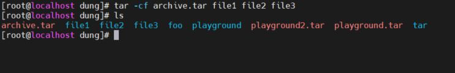

ARCHIVING AND TRANSFERRING FILES

Managing Compressed Tar Archives
Transferring Files Between Systems Securely
Synchronizing Files Between Systems Securely

Managing Compressed Tar Archives

Câu Lệnh tar 

Lệnh tar giúp người dùng nén các file lại 

Cấu trúc lệnh tar

tar mode[options] pathname... 

 13.5

Các option của tar 

-c, --create:   Tạo kho lưu trữ mới 

-x, --extract:  Giải nén 

-t, --list: Liệt kê các mục trong file nén 

-v, --verbose : Show các tâpk tin được lưu trữ hay đã giải nén 

-f, --file= :  

-p, --preserve-permissions : giữ nguyên quyền của tập tin và thư mục khi giải nén 

-z, --gzip : sử dụng gzip để nén 

-j, --bzip2 : nén với bzip2 có file dung lượng sau khi nén bé hơn gzip 

-J, --xz : Sử dụng xz để nén, file nén có dung lượng ít hơn bzip2 

ARCHIVING FILES AND DIRECTORIES

` tar -cf archive.tar file1 file2 file3 `

Lab tar

Nén và hiển thị nội dung nén 

13.2 

` tar cf playground.tar playground`

` tar tf playground.tar`

Để hiện thị kĩ hơn ta dùng lệnh 

` tar tvf playground.tar`

13.3 

Giải né trong một thư mục mới 

` tar xf ../playground.tar` 

13.4

 Mặc định cho các đường dẫn là tương đối, thay vì tuyệt đối. tar

 Đường dẫn tương đối, tuyệt đối với câu lệnh tar

CREATING A COMPRESSED ARCHIVE

• -z or --gzip for gzip compression (filename.tar.gz or filename.tgz)

• -j or --bzip2 for bzip2 compression (filename.tar.bz2)

• -J or -xz for xz compression (filename.tar.xz)

gzip

Tạo file foo.txt nén nó bằng gzip và giải nén bằng lệnh gunzip 

` gzip foo.txt`

`  gunzip foo.txt`

13.6

gzip Options 

13.5 

bzip2 

13.7

TRANSFERRING FILES BETWEEN SYSTEMS SECURELY

TRANSFERRING FILES USING SECURE COPY

scp : Sao chép các tệp từ một remote system tới local system hay ngược lại 

13.8

13.9 

sftp 

13.10

