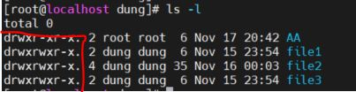
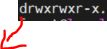
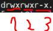
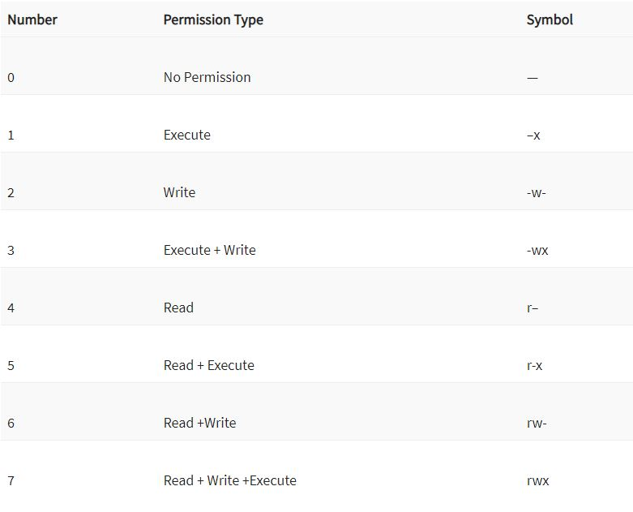
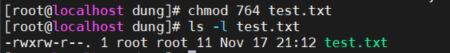
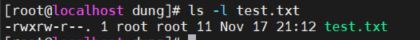
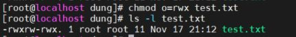
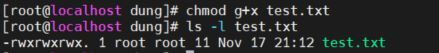
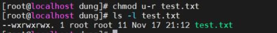

CONTROLLING ACCESS TO FILES

[1 Các khái niệm và cách thức phân quyền ](#1)

[2 Nguồn](#2)  

 
## 1 Các khái niệm: 
Quyền sở hữu các tệp tin trong Linux: tất cả các tệp tin được gắn với 3 loại chủ sở hữu 

-	User: chủ sở hữu một tệp tin. Theo mặc định khi tạo một tệp tin thì là chủ của nó luôn
-	Group: Thay vì cấp quyền truy cập một thư mục có thể dung group để gom hết những người đó lại
-	Other: người không tạo ra tệp tin cũng không được cấp quyền 					

Có 3 quyền mà các chủ sở hữu có thể thực hiện: 
	Read: Đọc nội dung của file đó 

	Write: cho phép sửa đổi nội dung thư mục, xóa, thay đổi tên tệp trong thư mục. Nhưng không thể xóa, di chuyển ra khỏi thư mục 

	Excute: khi có quyền này, có thể chạy một chương trình 

Sử dụng ls –l kiểm tra các file, thư mục tồn tại vị trí đang đứng 
 
 

Phần được khoanh đỏ cho biết các quyền được cung cấp cho user, group, other 

 
 
Kí tự đầu tiên hiển thị cho loại file. Ở đây chữ d biểu thị cho directory 

Các kí tự khác 

r = read permission

w = write permission

x = execute permission

– = no permission

 
(1): rwx quyền của user 

(2): rwx quyền của group 

(3): quyền của others

1.	Absolute mode

•	Thay đổi quyền truy cập tệp/ thư mục với lệnh `chmod`

 
 

Ví dụ quyền hiện tại: 

  

Thay đổi bằng lệnh `chmod`

`chmod 764 test.txt`

  

Ví dụ: 

•	read + execute = 5

•	read + execute + write = 4+2+1 = 7
 
2.	Symbolic mode

 
Ví dụ: 
Các quyền hiện tại 

  

Thêm quyền cho others 
` chmod o=rwx test.txt`
 
 

Thêm quyền execute cho group
`chmod g+x test.txt`
 
 

Loại bỏ quyền đọc của user 
` chmod u-r test.txt`
  
  

## 2. Nguồn 
 
https://www.guru99.com/file-permissions.html