#  Creating, Viewing, and Editing Text Files

## 1. STANDARD INPUT, STANDARD OUTPUT, AND STANDARD ERROR

Standard input: đầu vào tư bàn phím (0)

Standard output: đầu ra thiết bị (1)

Standard error: báo lỗi (2)

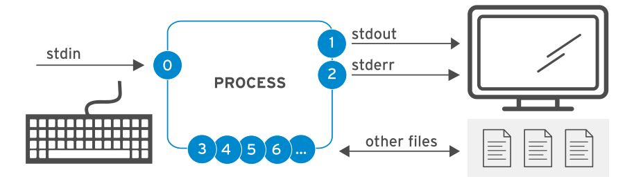

`>file` : ghi đè file. ví dụ 

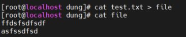

`>>file` Viết tiếp vào file

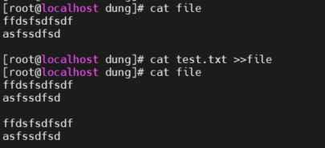

## 2.EDITING TEXT FILES FROM THE SHELL PROMPT

  

Vim: là trình sửa văn bản trong Linux

Các chế độ làm việc với Vim: 

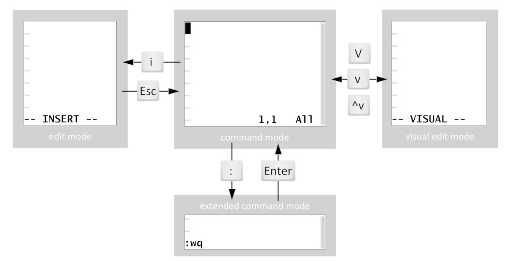

| Normal       | Mặc định để điều hướng và chỉnh sửa đơn giản   |
| ------------ | ---------------------------------------------- |
| Insert       | Để chèn và sửa đổi văn bản rõ ràng             |
| Command Line | Đối với các hoạt động như saving, exiting, etc |

​     Bây giờ mình đang ở chế độ Normal. Nếu trong file có dữ liệu thì có thể di chuyển xung quanh bằng các phím mũi tên hoặc tổ hợp phím điều khác. Để đảm bảo mình đang ở chế độ Normal, chỉ cần nhấn phím **Esc** (Escape). Tiếp theo nếu mình nhấn dấu hai chấm trong chế độ Normal thì sẽ chuyển Vim sang chế độ Command Line và gõ **:q!** - lệnh thoát khỏi trình soạn thảo mà không lưu

Mở file văn bản với vi: 

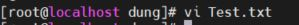

1.  Insert: chế độ chèn văn bản

   giao diện chế độ insert 

  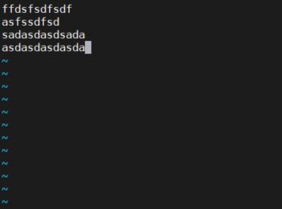

2. Visual: chế độ bôi đen văn bản 

   v: bôi đen 1 kí tự 

   ctrl+v: bôi đen khối văn bản

   shift+v: bôi đen dòng văn bản 

   

- Các phím tắt dùng trong vim: 

  `:x` `:wq` lưu văn bản và thoát 

## 3. LAB

1. Tạo file final.txt, chuyển tất cả các nội dung trong thư mục gốc vào 

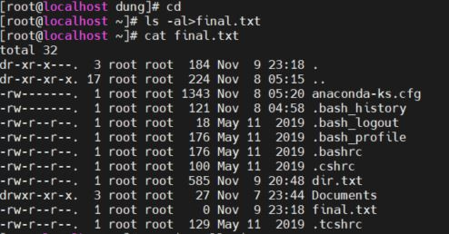

2. Mở file final.txt bằng vim 

3. xóa 3 dòng đầu tiên bằng `shift V` và `x` 

   Trước khi xóa 

   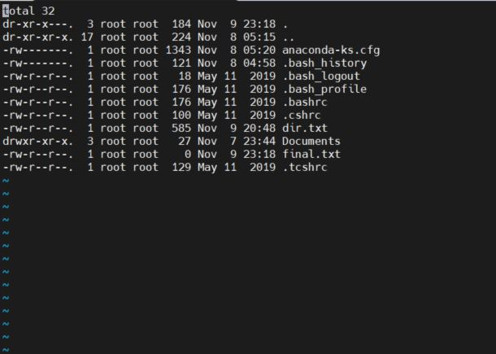

xóa 3 dòng đầu bằng `shift v` và `x` 

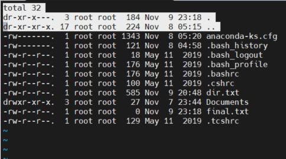

Chuyển về chế độ insert. Xóa kí tự cuối cùng với phím x

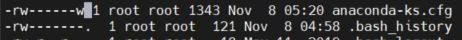

Xóa Cột bằng `ctrl+v` và phím x 

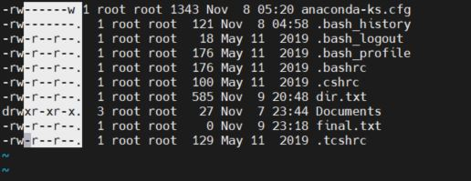

Xóa Documents bằng `v` và các phím điều hướng, phím `x` 

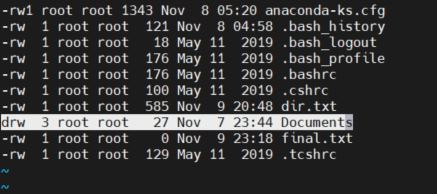

Bấm `Esc`  dùng lệnh `:wq` để lưu và thoát 
