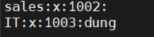
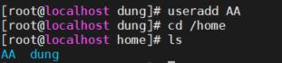
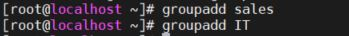
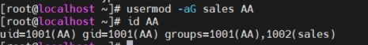
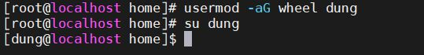
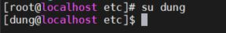
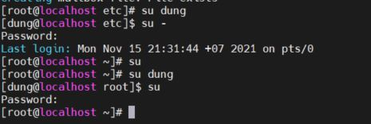

# MANAGING LOCAL USERS AND GROUPS  

1. ## Các khái niệm 

2. ## Câu lệnh thường sử dụng

3. ## Lab

   

## 1.Các khái niệm 

   1. ### User 

      Tại sao phải tạo các user account? Để phân quyền và cung cấp ranh giới người dùng bảo mật với nhau người ta tạo các user khác nhau 

Có 3 loại user: superuser, system users, regular users  

- SuperUser là để quản trị hệ thống. Có quyền truy cập vào toàn bộ hệ thống

- System users: Được phân quyền để hỗ trợ dịch vụ, cho phép quản lí các thư mục thường dùng

- regular user: Có quyền truy cập hạn chế vào hệ thống

  2. ### Group

       group là nhóm người dùng được phân quyền vào mục đích kiểm soát thư mục nào đó trong hệ thống 

- Trường 1: tên nhóm 
- Trường 2: mật khẩu 
- Trường 3:  số GID
- Trường 4: Tên các user được thêm vào nhóm

3. ### Primary Groups and Supplementary Groups  

` /etc/passwd` :thư mục quản lí mật khẩu người dùng 

`/etc/group   ` : thư mục quản lí group 

4. ### Lệnh su và sudo: 

- Lệnh `su`: hỗ trợ người dùng chuyền quyền truy cập 
- Lệnh `sudo`: hỗ trợ người dùng trong một số tác vụ chuyển về quyền root mà không cần mậ khẩu 

2. ## Các câu lệnh thường sử dụng 

- Tạo user mới: 

  

- Tạo group mới: 

  

- Thêm user vào nhóm: 

  

- cấp quyềnđể user có quyền như root 

  

- Các câu lệnh su 

  Lệnh su cho phép người dùng chạy shell như một người dùng khác

  `su <user_name>`

​        `su -` `su`

