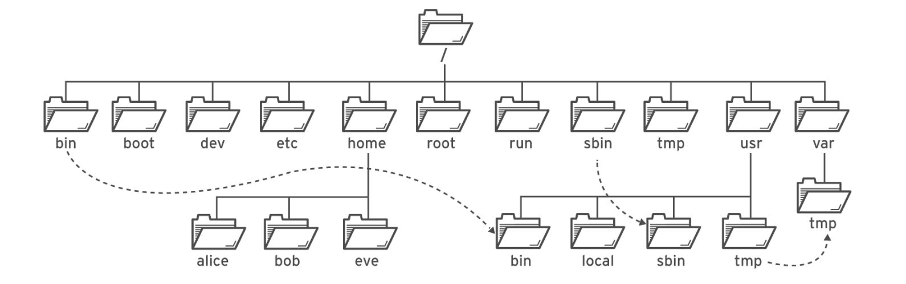
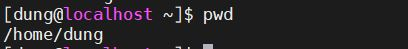
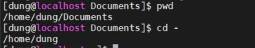
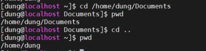

# Managing Files From The Command The Line

## 1. Giới thiệu 

- Mô tả cách thức tổ chức file trong Linux 
- Định vị vị trí của bạn trong Linux thông qua vị trí các tệp tin 
- Tạo, xóa, di chuyển các file và thư mục
- Tạo các tệp tham chiếu
- Các câu lệnh ảnh hưởng đến nhiều file 

## 2. Các câu lệnh thường sử dụng 

## 3. Lab

## 1. Giới thiệu 

###    Mô tả cách thức tổ chức file: 

 

Hệ thống tập tin của Linux và Unix được tổ chức theo một hệ thống phân bậc tương tự cấu trúc của một cây phân cấp. Bậc cao nhất của hệ thống tập tin là thư mục gốc, được ký hiệu bằng gạch chéo “/” (root directory).

Nằm dưới thư mục gốc (/) có một loạt các thư mục quan trọng của hệ thống tập tin được công nhận ở tất cả các bản phân phối Linux khác nhau. Dưới đây là danh sách các thư mục thông thường được nhìn thấy dưới thư mục gốc (/):

Ở mục này em mới tìm hiểu và thực hành được các mục /-Root; /etc ;/tmp; /usr; /home các mục còn lại em chưa thực hành mà mới chỉ đọc tài liệu viết vào cho đủ các loại thư mục 

1. / – Root

- Mở từng tập tin và thư mục từ thư mục Root.

- Chỉ có Root user mới có quyền viết dưới thư mục này.

- Lưu ý rằng /root là thư mục gốc của Root user.

2. /bin – User Binaries

- Chứa các tập tin thực thi nhị phân (binary executables).

- Lệnh Linux phổ biến sử dụng ở chế độ Singer-user mode nằm trong thư mục này.

- Tất cả user trên hệ thống nằm tại thư mục này đều có thể sử dụng lệnh.

- Ví dụ: ps, ls, ping, grep, cp.

3. /sbin – System Binaries

- Cũng giống như /bin, /sbin cũng chứa tập tin thực thi nhị phân (binary executables).

- Lệnh Linux nằm trong thư mục này được sử dụng bởi Admin hệ thống, nhằm mục đích duy trì hệ thống.

- Ví dụ: iptables, reboot, fdisk, ifconfig, swapon.

4. /etc – Configuration Files

- Chứa cấu hình các tập tin cấu hình của hệ thống, các tập tin lệnh để khởi động các dịch vụ của hệ thống……

- Ngoài ra /etc còn chứa shell scripts startup và shutdown, sử dụng để chạy/ngừng các chương trình cá nhân.

- Ví dụ: /etc/resolv.conf, /etc/logrotate.conf.

5. /dev – Files device

- Chứa các tập tin để nhận biết cho các thiết bị của hệ thống (device files).

- Bao gồm thiết bị đầu cuối, USB hoặc các thiết bị được gắn trên hệ thống.

- Ví dụ: /dev/tty1, /dev/usbmon0

6. /proc – Process Information

- Chưa các thông tin về System Process.

- Đây là hệ thống tập tin giả có chứa thông tin về các quá trình đang chạy. chẳng hạn như thư mục /proc/{pid} có chứa thông tin về quá trình đặc biệt của pid.

- Đây là một hệ thống tập tin ảo có thông tin về tài nguyên hệ thống. Chẳng hạn như /proc/uptime.

7. /var – Variable Files

- Var là viết tắt của variable file, lưu lại tập tin ghi các số liệu biến đổi (variable files).

- Nội dung các tập tin được dự kiến sẽ tăng lên tại thư mục này.

- Bao gồm: hệ thống tập tin log (/var/log), các gói và các file dữ liệu (/var/lib), email (/var/mail), print queues (/var/spool); lock files (/var/lock); các file tạm thời cần khi reboot (/var/tmp).

8. /tmp – Temporary Files (các tập tin tạm thời)

- Thư mục chứa các tập tin tạm thời được tạo bởi hệ thống và user.

- Các tập tin tạo thư mục này được xóa khi hệ thống được khởi động lại (reboot).

9. /usr – User Programs

- Chứa các ứng dụng, thư viện, tài liệu và mã nguồn các chương trình thứ cấp.

- /usr/bin chứa các tập tin của các ứng dụng chính đã được cài đặt cho user. Nếu bạn không tìm thấy user binary tại thư mục /bin, bạn có thể tìm tại thư mục /usr/bin. Ví dụ như at, awk, cc, less, scp.

- /usr/sbin có chứa các tập tin ứng dụng cho Admin hệ thống. Nếu không tìm thấy hệ nhị phân tại /sbin, bạn có thể tìm tại /usr/sbin. Chẳng hạn như atd, cron, sshd, useradd, userdel.

- /usr/lib chứa thư viện /usr/bin và /usr/sbin.

- /usr/local chứa các chương trình user mà bạn cài đặt từ nguồn.

Chẳng hạn khi bạn cài đặt apache từ nguồn, apache nằm dưới /usr/local/apache2.

10. /home – thư mục Home

- Thư mục chính lưu trữ các tập tin cá nhân của tất cả user.

- Ví dụ: /home/john, /home/nikita.

11. /boot – Boot Loader Files

- Chứa các tập tin cấu hình cho quá trình khởi động hệ thống.

- Các file Kernel initrd, vmlinux, grub nằm trong /boot.

- Ví dụ: nitrd.img-2.6.32-24-generic, vmlinuz-2.6.32-24-generic.

12. /lib – System Libraries

- Chứa các file thư viện hỗ trợ các thư mục nằm dưới /bin và /sbin.

- Tên file thư viện có thể là ld* hoặc lib*.so.*.

- Ví dụ: ld-2.11.1.so, libncurses.so.5.7.

13. /opt – Optional add-on Applications

- Opt là viết tắt của Optional (tùy chọn).

- Chứa các ứng dụng add-on từ các nhà cung cấp.

- Ứng dụng add-on được cài đặt dưới thư mục /opt/ hoặc thư mục /opt/ sub.

14. /mnt – Mount Directory

- Gắn kết các thư mục hệ thống tạm thời (thư mục Temporary) nơi Sysadmins có thể gắn kết các file hệ thống.

15. /media – Removable Media Devices

- Gắn kết các thư mục Temporary (thư mục tạm thời) được hệ thống tạo ra khi một thiết bị lưu động (removable media) được cắm vào như đĩa CDs, máy ảnh kỹ thuật số...

- Ví dụ: /media/cdrom for CD-ROM; /media/floppy for floppy drives; /media/cdrecorder for CD writer.

16. /srv – Service Data

- Svr viết tắt của service.

- Chứa các service của máy chủ cụ thể liên quan đến dữ liệu.

- Ví dụ: /srv/cvs chứa dữ liệu liên quan đến CVS.

### Định vị vị trí của bạn trong Linux thông qua vị trí các tệp tin 

- Absolute path: một đường dẫn đi từ thư mục gốc  

- Relative path: đường dẫn bắt đầu tại thư mục hiện tại 

- Navigating Paths: loại đường dẫn cho ta xác định được vị trí hiện tại thông qua Relative path 

Ví dụ khi vừa đăng nhập sử dụng lệnh sau để xác định vị trí hiện tại 

khi vừa đăng nhập vào đang đứng tại /home/dung 

## 2. Các câu lệnh thường dùng

1. #####  Các lệnh `cd` 

`cd -` trở về thư mục trước đó vừa đứng 

Ví dụ:   

Đang đứng tại vị trí `/home/user/Videos` sau khi dùng lệnh nó quay lại vị trí trước đó là `/home/user/Documents`

lệnh `cd ..` thoát ra 1 lớp đứng ở trước nó ví dụ 

Đang đứng tại vị trí `/home/user/Videos ` sau khi sử dụng lệnh ra vị trí `/home/user` 

Hôm nay em mới tới đây. Các báo cáo sau em sẽ cập nhật thêm ạ

2. ##### Các lệnh `ls` 

-  Lệnh `ls`  hiển thị các file trong thư mục

- Lệnh ` ls -t`hiển thị các file thay đổi theo thời gian 

- Lệnh `ls -1` hiển thị các file trên từng dòng 

  

- Lệnh ` ls -r` giống ls nhưng được xếp ngược lại 

  

- Lệnh `ls -s`Hiển thị các file theo kích thước giảm dần 

  

3. #####  Lệnh mkdir (make directory - tạo thư mục)

- ​       `mkdir <ten_thu_muc>` Tạo thư mục tại vị trí đang đứng

  

- `mkdir -p <file>`: tạo file và thư mục cha chứa nó nếu cần. 

  

- `mkdir -v <ten_thu_muc>` Tạo thư mục và hiển thị thông báo thư mục 

  ##### 

  4. ##### Lệnh rmdir (remove directory - Xóa thư mục)

  

- `rmdir` xóa thư mục rỗng 

  

- `rmdir -p`: xóa tất cả file trong đó 

  

Nguồn tham khảo: 

https://quantrimang.com/he-thong-tap-tin-va-thu-muc-tren-linux-45046leenhj `