 # Managing Networking
[1. DESCRIBING NETWORKING CONCEPTS](#1) 

[2. VALIDATING NETWORK CONFIGURATION](#2) 

[3. CONFIGURING NETWORKING FROM THE COMMAND LINE](3)

# 1. DESCRIBING NETWORKING CONCEPTS 

TCP/IP Networl model:

eth0, eth1, and eth2 for each network interface

# 2. VALIDATING NETWORK CONFIGURATION  

## GATHERING NETWORK INTERFACE INFORMATION

`ip link show`

liệt kê tất cả các giao diện mạng có sẵn trên hệ thống của bạn

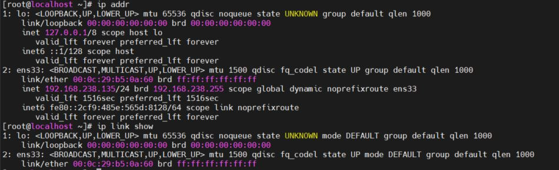

lo: đó là thiết bị loopback được kết nối với chính máy chủ

ens33 là giao diện card mạng 

### Displaying IP Addresses

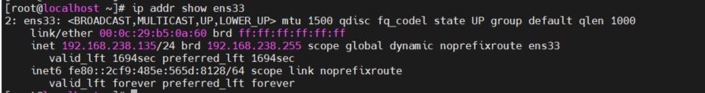

1: trạng thái card mạng là up 
2: Địa chỉ Mac 
3: Địa chỉ IPv4 
4: địa chỉ IPv6 

### Displaying Performance Statistics

Jiển thị hiệu năng sử dụng mạng. Thống kê các gói nhận được(RX) gói đã truyền(TX), gói lỗi và gói đã bị drop 

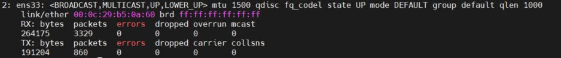

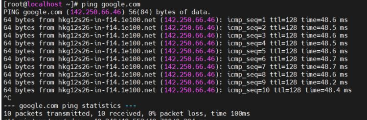

## CHECKING CONNECTIVITY BETWEEN HOSTS

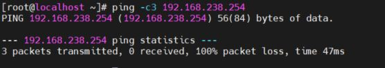

Lệnh `ping6 ` nó cũng hoạt động như ping nhưng dành cho địa chỉ IPv6   ????  

Ping tới các mạng cục bộ 

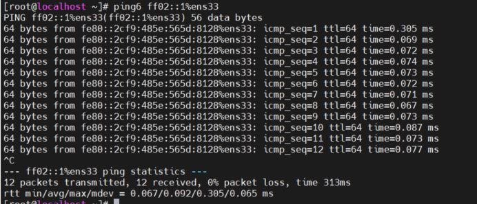

các địa chỉ cục bộ của IPv6 có thể được sử dụng bởi các máy chủ khác trên cùng một liên kết, giống như địa chỉ bình thường.

## TROUBLESHOOTING ROUTING

Các công cụ định tuyến

### Displaying the Routing Table 

` ip route` sử dụng câu lệnh này để hiển thị thông tin định tuyến 

` ip -6 route`

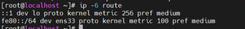

::1 dev lo proto kernel metric 256 pref medium(sử dụng card mạng lo)

fe80::/64 dev ens33 proto kernel metric 100 pref medium(sử dụng card mạng ens33 cho địa chỉ liên kết cục bộ)

Theo mặc định, tất các mạng IPv6(the ::/0 network) có thể tuy cập qua bộ định tuyến 2001:db8:0:1::ffff thông qua cổng ens33 

### Tracing Routes Taken by Traffic ???

Sử dụng câu lệnh ` traceroute` hoặc `tracepath` để xác định lưu lượng mạng thông qua bộ định tuyến , các gói ICMP

Cả 2 sử dụng cơ chế UDP để theo dõi đường dẫn. Tuy nhiên nhiều mạng chăn UDP cà ICMP. Lệnh ` tracẻoute` có các tùy chọn để theo dõi đường dẫn với UDP

## TROUBLESHOOTING PORTS AND SERVICES

(Phải đọc kĩ sau)

TCP sử dụng sockets dưới dạng điểm cuối để liên lạc và được tạo từ địa chỉ IP. Các cổng chuẩn được lưu ở /etc/

Lệnh ` ss` được sử dụng để thay cho ` Netstat`

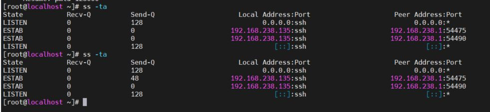

# 3. CONFIGURING NETWORKING FROM THE COMMAND LINE

Hướng dẫn sử dụng ` nmcli` 

## DESCRIBING NETWORKMANAGER CONCEPTS 

Ngoài các daemon ra thì GNOME Notification Area applet cung cấp các trạng thái thông tin mạng. Nó được cấu hình ở thư mục etc/sysconfig/network-scripts 

## VIEWING NETWORKING INFORMATION 

` nmcli dev status` : Hiện thị trạng thái của tất cả các mạng 

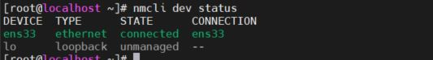 

` nmcli con show`: chỉ liệt kê các hoạt động kết nối, có thêm tùy chọn --active 

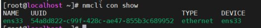 

## ADDING A NETWORK CONNECTION

`  nmcli con add  `   để thêm mạng mới 

 Lệnh sau thêm mạng mới có tên ens2 

 Tệp cấu hình của mạng được lưu ở /etc/
sysconfig/network-scripts/ifcfg-ens2

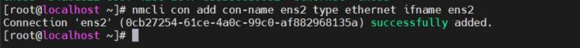

Tạo kết nối ens2 cho thiết bị với địa chỉ IPv4 tĩnh 