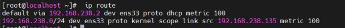

 # Managing Networking
[1. DESCRIBING NETWORKING CONCEPTS](#1) 

[2. VALIDATING NETWORK CONFIGURATION](#2) 

[3. CONFIGURING NETWORKING FROM THE COMMAND LINE](3)

# 1. DESCRIBING NETWORKING CONCEPTS 

TCP/IP Networl model:

 * Application: 
               
               Đây là lớp giao tiếp trên cùng của mô hình. Đúng với tên gọi, tầng Ứng dụng đảm nhận vai trò giao tiếp dữ liệu giữa 2 máy khác nhau thông qua các dịch vụ mạng khác nhau (duyệt web, chat, gửi email, một số giao thức trao đổi dữ liệu: SMTP, SSH, FTP,...). Dữ liệu khi đến đây sẽ được định dạng theo kiểu Byte nối Byte, cùng với đó là các thông tin định tuyến giúp xác định đường đi đúng của một gói tin.

* Transport:

      Chức năng chính của tầng 3 là xử lý vấn đề giao tiếp giữa các máy chủ trong cùng một mạng hoặc khác mạng được kết nối với nhau thông qua bộ định tuyến. Tại đây dữ liệu sẽ được phân đoạn, mỗi đoạn sẽ không bằng nhau nhưng kích thước phải nhỏ hơn 64KB. Cấu trúc đầy đủ của một Segment lúc này là Header chứa thông tin điều khiển và sau đó là dữ liệu.

          Trong tầng này còn bao gồm 2 giao thức cốt lõi là TCP và UDP. Trong đó, TCP đảm bảo chất lượng gói tin nhưng tiêu tốn thời gian khá lâu để kiểm tra đầy đủ thông tin từ thứ tự dữ liệu cho đến việc kiểm soát vấn đề tắc nghẽn lưu lượng dữ liệu. Trái với điều đó, UDP cho thấy tốc độ truyền tải nhanh hơn nhưng lại không đảm bảo được chất lượng dữ liệu được gửi đi.

* Internet: 

        Nó được định nghĩa là một giao thức chịu trách nhiệm truyền tải dữ liệu một cách logic trong mạng. Các phân đoạn dữ liệu sẽ được đóng gói (Packets) với kích thước mỗi gói phù hợp với mạng chuyển mạch mà nó dùng để truyền dữ liệu. Lúc này, các gói tin được chèn thêm phần Header chứa thông tin của tầng mạng và tiếp tục được chuyển đến tầng tiếp theo. Các giao thức chính trong tầng là IP, ICMP và ARP.

* Link

        Là sự kết hợp giữa tầng Vật lý và tầng liên kết dữ liệu của mô hình OSI. Chịu trách nhiệm truyền dữ liệu giữa hai thiết bị trong cùng một mạng. Tại đây, các gói dữ liệu được đóng vào khung (gọi là Frame) và được định tuyến đi đến đích đã được chỉ định ban đầu.

### DESCRIBING NETWORK INTERFACE NAMES
  Ở các phiên bản cũ của Red Hat Enterprise Linux sử dụng các tên là eth0, eth1, and eth2 để đặt cho mỗi card mạng. Thứ từ được xếp bắt đầu từ eth0 - cổng mạng đầu tiên phát hiện ra. Ở các phiên bản sau đó thì ko còn đặt tên cổng mạng như thế nữa. 

  Các cổng mạng được đắt tên theo quy tắc: 

  Ethernet bắt đầu bằng ` en`

  WLAN bắt đầu bằng ` wl`

  WWAN bắt đầu bằng ` ww` 

### IPv4 Addresses

Sử dụng 32 bit để biểu diễn, chia thành 4 cụm 8 bit(gọi là octet). Các octet được biểu diễn dưới dạng thập phân và được ngăn cách nhau bằng các dấu chấm, hiển thị các số từ 0-255 

Địa chỉ IP được chia thành hai phần: phần mạng (network) và phần host.

 Hình 12.1 sách Red_Hat_Enterprise

 Địa chỉ IP phải tuân theo các quy tắc sau:

 * Các bit phần mạng không được phép đồng thời bằng 0.

      Ví dụ: Địa chỉ 0.0.0.1 với phần mạng là 0.0.0 và phần host là 1 là không hợp lệ.

* Nếu các bit phần host đồng thời bằng 0, ta có một địa chỉ mạng.

    Ví dụ: Địa chỉ 192.168.1.1 là một địa chỉ có thể gán cho host nhưng địa chỉ 192.168.1.0 là một địa chỉ mạng, không thể gán cho host được.

* Nếu các bit phần host đồng thời bằng 1, ta có một địa chỉ broadcast.

   Ví dụ: Địa chỉ 192.168.1.255 là địa chỉ broadcast cho mạng 192.168.1.0

   ### IPv6 Addresses

   Địa chỉ IPv6 là một số 128 bit, thường được biểu thị bằng 8 cụm 16 bit, mỗi cụm được biểu diễn qua hexa (cụm nibble)

   ### IPv6 Subnetting

   Địa chỉ IPv6 thường chia làm 2 phần: network và interface ID

# 2. VALIDATING NETWORK CONFIGURATION  

## GATHERING NETWORK INTERFACE INFORMATION

`ip link show`

liệt kê tất cả các giao diện mạng có sẵn trên hệ thống của bạn

lo: đó là thiết bị loopback được kết nối với chính máy chủ

ens33 là giao diện card mạng 

### Displaying IP Addresses

1: trạng thái card mạng là up 
2: Địa chỉ Mac 
3: Địa chỉ IPv4 
4: địa chỉ IPv6 

### Displaying Performance Statistics

Jiển thị hiệu năng sử dụng mạng. Thống kê các gói nhận được(RX) gói đã truyền(TX), gói lỗi và gói đã bị drop 

## CHECKING CONNECTIVITY BETWEEN HOSTS

Lệnh `ping6 ` nó cũng hoạt động như ping nhưng dành cho địa chỉ IPv6   ????  

Ping tới các mạng cục bộ 

các địa chỉ cục bộ của IPv6 có thể được sử dụng bởi các máy chủ khác trên cùng một liên kết, giống như địa chỉ bình thường.

## TROUBLESHOOTING ROUTING

Các công cụ định tuyến

### Displaying the Routing Table 

` ip route` sử dụng câu lệnh này để hiển thị thông tin định tuyến 

` ip -6 route`

::1 dev lo proto kernel metric 256 pref medium(sử dụng card mạng lo)

fe80::/64 dev ens33 proto kernel metric 100 pref medium(sử dụng card mạng ens33 cho địa chỉ liên kết cục bộ)

Theo mặc định, tất các mạng IPv6(the ::/0 network) có thể tuy cập qua bộ định tuyến 2001:db8:0:1::ffff thông qua cổng ens33 

### Tracing Routes Taken by Traffic ???

Sử dụng câu lệnh ` traceroute` hoặc `tracepath` để xác định lưu lượng mạng thông qua bộ định tuyến , các gói ICMP

Cả 2 sử dụng cơ chế UDP để theo dõi đường dẫn. Tuy nhiên nhiều mạng chăn UDP cà ICMP. Lệnh ` tracẻoute` có các tùy chọn để theo dõi đường dẫn với UDP

## TROUBLESHOOTING PORTS AND SERVICES

(Phải đọc kĩ sau)

TCP sử dụng sockets dưới dạng điểm cuối để liên lạc và được tạo từ địa chỉ IP. Các cổng chuẩn được lưu ở /etc/

Lệnh ` ss` được sử dụng để thay cho ` Netstat`

# 3. CONFIGURING NETWORKING FROM THE COMMAND LINE

Hướng dẫn sử dụng ` nmcli` 

## DESCRIBING NETWORKMANAGER CONCEPTS 

Ngoài các daemon ra thì GNOME Notification Area applet cung cấp các trạng thái thông tin mạng. Nó được cấu hình ở thư mục etc/sysconfig/network-scripts 

## VIEWING NETWORKING INFORMATION 

` nmcli dev status` : Hiện thị trạng thái của tất cả các mạng 

 

` nmcli con show`: chỉ liệt kê các hoạt động kết nối, có thêm tùy chọn --active 

 

## ADDING A NETWORK CONNECTION

`  nmcli con add  `   để thêm mạng mới 

 Lệnh sau thêm mạng mới có tên ens2 

 Tệp cấu hình của mạng được lưu ở /etc/
sysconfig/network-scripts/ifcfg-ens2

Tạo kết nối ens2 cho thiết bị với địa chỉ IPv4 tĩnh 

Ảnh trang 418 sách Redhat_Enterprise 

`nmcli dev status` Hiển thị trạng thái tất cả cổng mạng

` nmcli con show` Liệt kê tất cả các kết nối

`nmcli con show name`  liệt kê các cài đặt cho kết nối hiện tại 

`nmcli con add con-name new` thêm kết nối mới có tên là new

` nmcli con mod name` Sửa đổi tên kết nối 

` nmcli con reload` Tải lại tất cả các tệp đã cấu hình 

` nmcli con up name` Kích hoạt tên kết nối 

`nmcli dev dis dev` Vô hiệu hóa và ngắt kết nối hiện tại trên cổng mạng dev

` nmcli con del name` Xóa tên kết nối và tệp cấu hình của nó

# 4. EDITING NETWORK CONFIGURATION FILES
Chỉnh sửa cấu hình mạng ở tệp cấu hình 

## DESCRIBING CONNECTION CONFIGURATION FILES
### LAB
* Tệp cấu hình mạn được lưu tại /etc/sysconfig/network-scripts/ifcfg-name

* Chỉnh sửa file /etc/sysconfig/network-scripts/ifcfg-ens33 thêm địa chỉ bổ sung 10.0.1.1/24

* Kích hoạt địa chỉ mới 

Tải lại các thay đổi cấu hình 

` nmcli con reload`

Khởi động lại các kết nối với thay đổi mới 

` nmcli con up "ens33"`

Xác nhận địa chỉ ip mới 

` ip addr show ens33`

