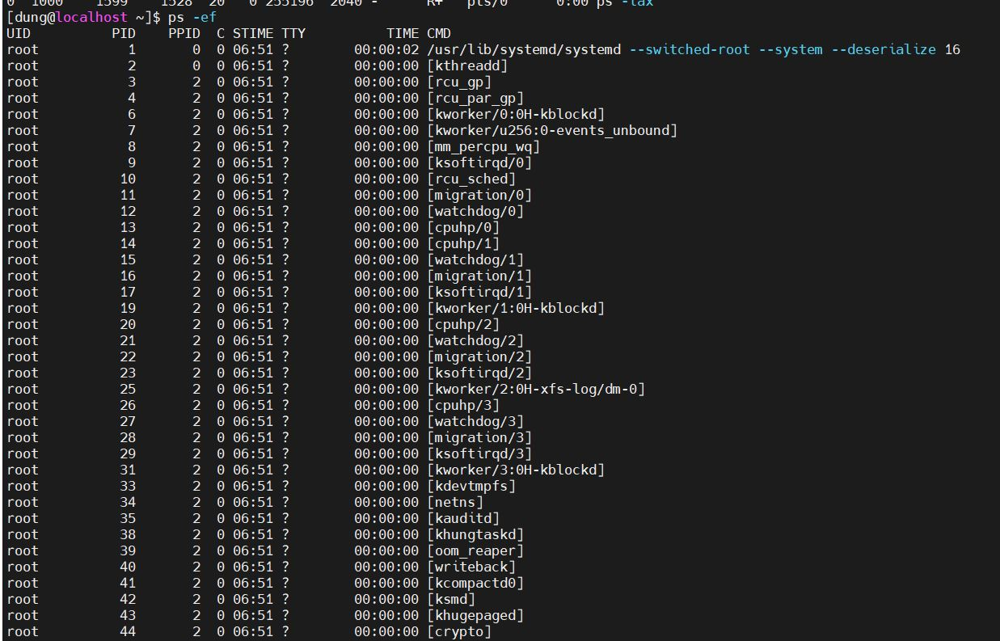

# Mục lục     
 * [1. Listing processes](#1)  
 * [2. Controlling jobs](#2)  
 * [3. Killing processes](#3)  
 * [4. Monitoring processes activity](#4)

   
###  1. Listing process
Tất cả các chương trình trong Unix thực chất đều là các *processes*: *terminal* bạn chạy, vim, hay bất cứ lệnh nào bạn gõ vào terminal. *Process* chính là đơn vị cấu thành nên Unix. Nói cách khác mỗi dòng code của bạn, sẽ được thực thi trên một *process*.

- Một `process` là một phiên bản đang chạy của hệ điều hành, có thể thực thi chương trình. Một `process` bao gồm:   
   - Địa chỉ vùng nhớ 
   - Quyền điều khiển, truy cập 
   - Một hoặc nhiều quyền thực thi của mã chương trình   
   - Trạng thái process    
- Môi trường của một process bao gồm:   
   - Biến toàn cục và biến cục bộ    
   - A current scheduling context. 
   - Tài nguyên hệ thống phân bổ. Ví dụ như cổng mạng 

#### Các tiến trình đều có tiến trình cha và con được mô tả ở sơ đồ 

#### Mô tả trạng thái process   
- Mỗi CPU (or CPU core) chỉ đang làm việc trong một process tại một thời điểm duy nhất.   

|Name|Flag|Mô tả|   
|----|----|----|   
|Running|R|Process  đang chạy hoặc sẵn sàng để chạy|  
|Sleeping|S |Process  đang đợi một event để tiếp tục chạy|   
|Daemon|D|Process đang đợi I/O|  
|Kill|K|Dừng process để cho phép một task đang chờ yêu cầu đến tín hiệu|    
|Stopped|T|Process đang trong quá trình dừng chạy|   
|Zombie|Z|Process bị chấm dứt nhưng chưa được giải phóng bởi parent process|  
|Execute|X|Process đã được hoàn thành |   
||<| Process có độ ưu tiên cao, có thể có nhiều thời gian CPU hơn|   
||N|Process có độ ưu tiên thấp, chỉ có thể chiếm CPU khi các process khác có độ ưu cao hơn hết thời gian CPU|   

- Khi xử lý sự cố một hệ thống, nó thì quan trọng để hiểu như thế nào giao tiếp kernel với process và như thế nào giao tiếp process với người khác.      
- Lệnh top: trình bày trạng thái của mỗi quy trình  
*Note: Trong một hệ thống CPU đơn, chỉ có một quá trình được chạy trong một thời điểm. Nó có thể để xem một vài process với trạng thái `R`. Tuy nhiên, không phải process nào cũng đang chạy, một vài process đang chờ.*    

`ps` để list ra tất cả các *process* đang chạy trên hệ thống:

Chạy lênh `ps` và show ra các thuộc tính `opid,ppid,user,rss,command` của *process*:

`ps -e -opid,ppid,user,rss,command`
Cấu trúc:  
      - `ps [option]`:    
      - Options:
         - `-aux`: trình bày tất cả process   
           
         - `-lax`: một danh sách dài cung cấp nhiều kỹ thuật chi tiết.   
          
         - `-ef`: trình bày tất cả thông tin process. 
             
         - `-fG` [tên user]: xem thông tin tiến trình thuộc nhóm người dùng nhất định.      
         - `-U root -u root u`: hiện thị thông tin tiến trình chạy dưới quyền root.   
           
         - `-o`: xem thông tin cụ thể của các tiến trình đang chạy.  
         
## 2. Controlling jobs    
    Quản lí nhiều processes từ cùng một session? 
    Trong Linux hoặc Unix, job được định nghĩa là một nhiệm vụ hoặc lệnh đã bắt đầu chạy nhưng chưa hoàn thành những gì nó đang làm.
    The main commands you use for job control in Linux are as follows.
`jobs` Liệt kê tất cả các lệnh đang chạy hoặc bị tạm dừng
`fg` mang job tới foreground 
`bg`mang job tới background
`Ctrl+z` Tạm dừng job
`Ctrl+c` Chấm dứt job
- Có 2 loại process: 
   - Foreground Process:
  
      Chạy một job chỉ dừng lại khi đã hoàn thành
   - Background Process:
      - Sẵn sàng chạy lệnh mới 
     - Để bắt đầu một background process thêm dấu "`&`" tại cuối lệnh.   

- Background process và foreground process thường được thao tác thông qua Jobs ID.   
- Lệnh `ps j`: Trình bày thông tin liên quan đến jobs.  
   
  ## 3.Killing process   
- Lệnh `kill`: là lệnh tắt process đang chạy   
- Cấu trúc:   
   - kill [option] [pid]   
       - Options:   
          - `1 HUP` (hangup): Khởi động lại process   
          - `2 INT`: Kết thúc process (Crtl + C)     
          - `3 QUIT`: Lưu và thoát khỏi process (Ctrl+ \ )    
          - `9 KILL`: Dừng process ngay lập tức    
          - `15 TERM`: Yêu cầu process dừng hoạt động. 
          - `18 CONTINUE`: Tiếp tục process.   
          - `19 STOP`: Dừng process tạm thời. (Ctrl + Z)

      Nguồn 
      https://study.com/academy/lesson/background-processes-in-linux-definition-manipulation.html#:~:text=In%20Linux%2C%20a%20background%20process,available%20to%20execute%20other%20commands.
      http://www.aboutlinux.info/2005/05/job-control-in-linux.html
