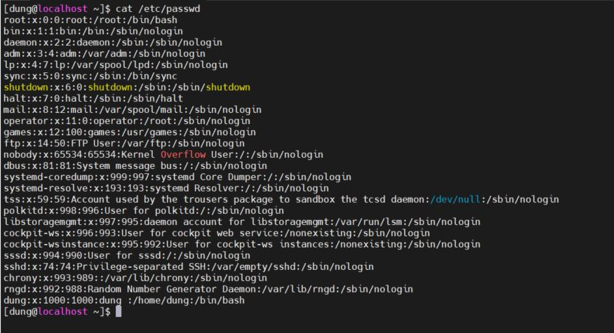
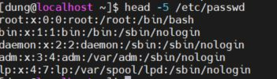
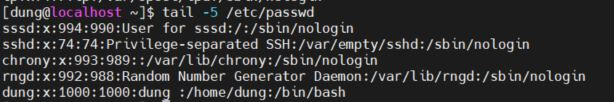
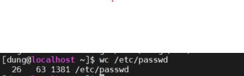
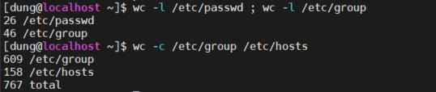

# 

## 1. Các khái niệm cơ bản 

## 2. Giới thiệu các tập lệnh 

## 3. Lab 


## 1. Các khái niệm cơ bản 

**Shell:** là giao diện mà người dùng làm việc với Linux

**Bash shell:** các câu lệnh tự động hóa các nhiệm vụ 

**Shell prompt: ** giao diện khi chờ người dùng truy cập 

**Command: **dòng lệnh nhập vào

**Option: ** hậu tố bổ trợ cho command 

**arguments: **mục tiêu, mục đích dòng lệnh 

**ssh:** gọi là Secure Shell, là một giao thức điều khiển từ xa cho phép người dùng kiểm soát và chỉnh sửa server từ xa qua Internet

**Physical Console:** kết nối phần cứng với hệ thống 

**Virtual Console:** hỗ trợ các phiên đăng nhập 

**Terminal:** Giao diện đầu ra 

## 2. Các dòng lệnh cơ bản 

khi vừa bắt đầu sẽ có giao diện để tạo user 

Lệnh **cat** xem nội dung một tệp

- cat /etc/passwd: danh sách user 

-   File /etc/passwd: lấy thông tin file user tồn tại trong hệ thống 


Lệnh `head` `tail`  dùng để xem những dòng đầu của tệp tin (theo mặc định là 10 dòng đầu tiên)

```
head [tuỳ chọn] file
```

```
tail [tuỳ chọn] file
```


- `-n, --lines=[-]n`: In số dòng n đầu tiên của mỗi tệp
- `-c, --byte=[-]n`: In số byte n đầu tiên của mỗi tệp
- `-q`: Không in tiêu đề xác định tên tệp
- `-v`: Luôn in tiêu đề xác định tên tệp
- `--help`: Hiển thị các trợ giúp
- `--version`: Thông tin về phiên bản và thoát

Lệnh wc (word count) trong các hệ điều hành Unix/ Linux được sử dụng để đếm số dòng mới, đếm số từ, đếm byte và ký tự trong một tệp được chỉ định bởi các file arguments. Cú pháp của lệnh wc như dưới đây: 

***wc [options] filenames***

Sau đây là các tùy chọn và cách sử dụng được cung cấp bởi lệnh

*wc -l*: prints số dòng trong một file. 

*wc -w*: prints số từ trong một file. 

*wc -c*: hiển thị số bytes trong một file. 

*wc -m*: prints số kí tự trong một file. 

*wc -L*: prints độ dài của dòng dài nhất trong một file

Các phím tắt: 

| SHORTCUT        | DESCRIPTION                       |
| --------------- | --------------------------------- |
| Ctrl+A          | Chuyển đến đầu dòng lệnh          |
| Ctrl+E          | Chuyển đến cuối dòng lệnh         |
| Ctrl+U          | xóa từ đầu đến vị trí con trỏ     |
| Ctrl+K          | xóa từ con trỏ đến cuối dòng lệnh |
| Ctrl+RightArrow | chuyển từ đầu trái sang đầu phải  |
| Ctrl+LeftArrow  | chuyển từ đầu phải sang đầu trái  |
|                 |                                   |


## 3. Lab

Phần lab có mấy câu lệnh em chưa hiểu lắm vì ở chương đầu nó mới viết kiểu giới thiệu nên em thực hành những câu lệnh đã hiểu ạ  

cat /etc/passwd:



```
head -5 /etc/passwd
```




```
tail -5 /etc/passwd
```



```
wc /etc/passwd  
```






https://blogd.net/linux/cach-su-dung-head-tail-less-more/

https://bizflycloud.vn/tin-tuc/huong-dan-su-dung-lenh-wc-va-vi-du-tren-linux-20180309115904199.htm