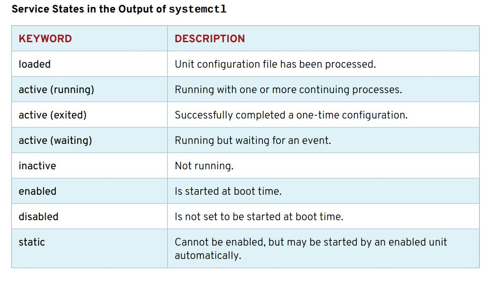
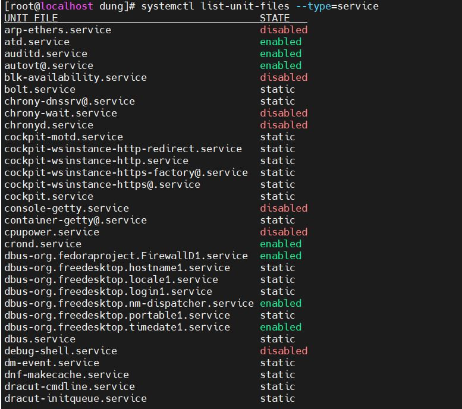
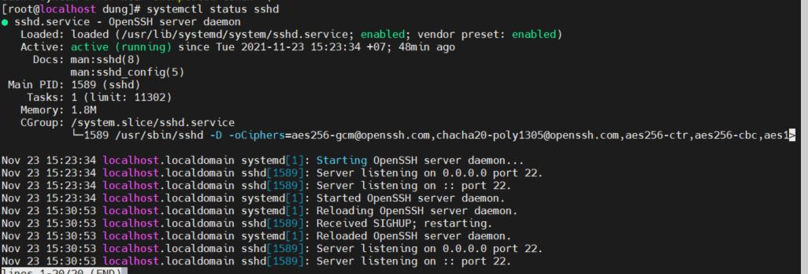
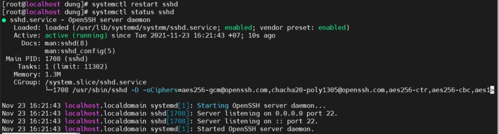
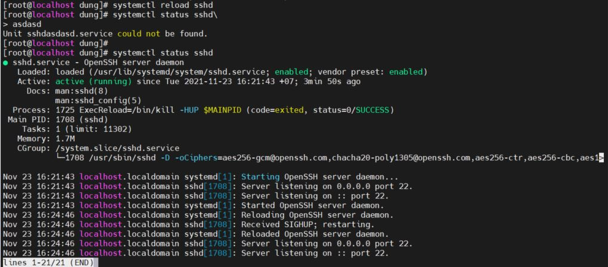
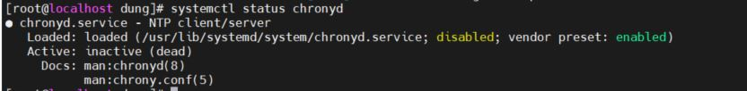
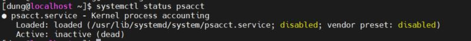
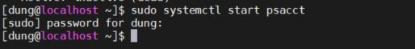
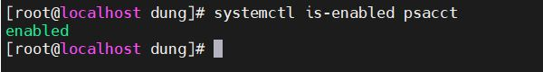

Controlling services and daemons 

1. [Các khái niệm](#1) 
2. [Lab](#2) 

## 1. Các khái niệm 
 
## Có ba loại process trong Linux: interactive, batch, daemon.
- 	Các interactive process sẽ chạy tương tác với người dùng tại giao diện dòng lệnh (chế độ all-text) như trên terminal ssh hoặc console.
-	Batch process được gửi vào hàng đợi thực thi tiến trình trong tương lai theo lịch và không liên kết tương tác với các dòng lệnh. Loại tiến trình này phù hợp để chạy các tác vụ lặp lại nhiều lần khi sử dụng hệ thống ở mức thấp.
-	Daemon được hệ thống xác định với bất kỳ process nào có process parent PID là 1, hay còn được gọi là process init. Init luôn là quá trình đầu tiên khởi động khi máy chủ khởi động và tồn tại trên máy chủ cho đến khi máy chủ tắt đi. Init chấp nhận bất kỳ process nào có parent process bị kill mà không cần quan tâm chờ trạng thái của child process. Vì vậy phương thức phổ biến để khởi chạy một daemon liên quan đến forking (tức là chia) một hoặc 2 và làm cho các process cũ, các parent process trong khi các child process vẫn thực hiện các chức năng bình thường của nó.

Systemd daemon: Quản lí các hoạt động khi khởi động linux, quản lí các ứng dụng chạy ẩn khi hệ thống đang chạy. Bắt đầu từ thời gian khởi động cho đến khi tắt máy 

các services cụ thể khi bắt đầu khởi động: 
- khả năng chạy nhiều tác vụ, tăng tốc độ của một hệ thống 
- Các tác vụ khởi động cùng lúc bật máy được daemon quản lí 
- Nhận biết các tác vụ tự động bật khi có môi trường cần thiết và tắt chúng đi khi chưa có môi trường. ví dụ các tác vụ cần internet sẽ được mở khi đã kết nối mạng 

## SERVICE UNITS

Mỗi phần mở rộng ứng với các tác vụ riêng của nó 

- .service : Các tác vụ hệ thống để chạy các tác vụ môi trường 
- .socket : khi thấy phần mở rộng này, daemon sẽ bỏ qua và chỉ được chạy khi có yêu cầu 
 - .path :tác vụ được trì hoãn cho đến khi có thay đổi tệp đó diễn ra ? 

 - Hiển thị trạng thái các tác vụ 
  

 ## 2. LAB 
  
  Liệt kê các tiến trình trong hệ thống 
 - `systemctl list-unit-files --type=service`
 
 SỬ DỤNG systemctl để khởi động lại và tải lại
 Hiển thị trạng thái của dịch vụ SSHD
- `systemctl status sshd`

Restart sshd 
`systemctl restart sshd`

Reload sshd 
`systemctl reload sshd`

Xác minh rằng dịch vụ Chronyd đang chạy
`systemctl status chronyd `

Xác minh trạng thái của psacct: 
`systemctl status psacct`

Đã bị vô hiệu hóa lúc khởi động 
Bắt đầu khởi động psacct 
`sudo systemctl start psacct` 

Bật psacct chạy trên hệ thống 
`systemctl is-enabled psacct` 

Nguồn 
https://cuongquach.com/daemon-trong-linux-la-gi.html
Sách Red_Hat_Enterprise_Linux_8_0